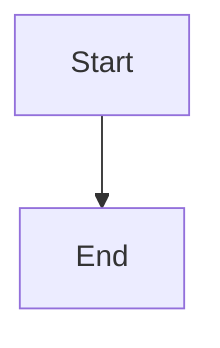

# World-Class Architecture Documentation Research

**Date:** 2026-01-07
**Mission:** Extract patterns, templates, and best practices from world-class developer tool documentation
**Target:** Create reusable documentation templates for 25+ independent tools extraction

---

## Table of Contents

1. [Executive Summary](#executive-summary)
2. [Tool-by-Tool Analysis](#tool-by-tool-analysis)
3. [Common Patterns Extraction](#common-patterns-extraction)
4. [Best Practices Identification](#best-practices-identification)
5. [Reusable Templates](#reusable-templates)
6. [Quality Checklists](#quality-checklists)
7. [Implementation Guide](#implementation-guide)

---

## Executive Summary

### The State of World-Class Documentation in 2025

After analyzing Express.js, React.dev, TypeScript, Vite, and Apollo GraphQL documentation, clear patterns emerge that distinguish exceptional documentation from merely adequate documentation.

**Key Finding:** Great documentation is not comprehensive—it's **progressive**. It meets users where they are and guides them forward incrementally.

### Core Principles Identified

1. **Progressive Disclosure Architecture**
   - Start with value proposition, not technical details
   - Layer information: overview → quick start → concepts → reference
   - Never overwhelm beginners with advanced options

2. **Learn-by-Doing Philosophy**
   - Every abstract concept paired with executable example
   - Code examples work copy-paste (no "left as exercise")
   - Interactive examples where possible (React excels here)

3. **Multiple Entry Points**
   - "I'm new here" → Tutorial path
   - "I know this stuff" → Reference path
   - "I have a problem" → Troubleshooting path
   - "I'm integrating" → API path

4. **Opinionated Best Practices**
   - Don't just document features—recommend patterns
   - Show "the React way" or "the TypeScript way"
   - Explain trade-offs, then take a stance

5. **Living Documentation**
   - Version-specific docs (React 18 vs 19)
   - Migration guides for breaking changes
   - "What's New" sections for releases
   - Deprecated feature clear warnings

### What Makes These Tools' Docs Exceptional

| Tool | Superpower | Signature Pattern |
|------|-----------|-------------------|
| **Express.js** | Simplicity | Minimal API, maximal examples |
| **React.dev** | Interactive learning | Live code sandboxes in-browser |
| **TypeScript** | Conceptual clarity | "Why" before "how" explanations |
| **Vite** | Developer experience | Zero-config to advanced continuum |
| **Apollo GraphQL** | Enterprise architecture | Reference architecture with diagrams |

### Recommended Approach for Our Tools

For Spreader, Cascade Router, and 23+ remaining tools:

**Adopt the "Three-Layer" Architecture:**

```
Layer 1: Landing (README.md)
├─ Value proposition (1 line)
├─ What it does (3 sentences)
├─ Quick start (5 minutes)
└─ "Learn more" links

Layer 2: Guide (docs/guide/)
├─ Getting Started
├─ Core Concepts
├─ How-To Guides
└─ Tutorials

Layer 3: Reference (docs/api/)
├─ CLI Commands
├─ API Reference
├─ Configuration
└─ Advanced Topics
```

### Critical Success Factors

**Must Have:**
- ✅ Working quick start (5 minutes or less)
- ✅ Code examples for every concept
- ✅ Progressive complexity (easy → hard)
- ✅ Search functionality
- ✅ Clear versioning strategy

**Nice to Have:**
- 🎯 Interactive examples (like React.dev)
- 🎯 Video walkthroughs
- 🎯 Community-contributed examples
- 🎯 AI-powered search (like Apollo's "Use with AI")

### Template Strategy

This research provides **5 production-ready templates**:

1. **README Template** - Landing page pattern
2. **Architecture Documentation Template** - System design explanation
3. **API Reference Template** - Function/CLI documentation
4. **User Guide Template** - Tutorial and how-to structure
5. **Contributing Guide Template** - Developer onboarding

Each template includes:
- Section-by-section structure
- Writing guidelines
- Code example formatting
- Diagram templates (ASCII art)
- Quality checklist

### Next Steps

1. ✅ Review this research report
2. ⏳ Apply README template to Spreader
3. ⏳ Apply README template to Cascade Router
4. ⏳ Create API reference for both tools
5. ⏳ Build interactive examples where possible
6. ⏳ Set up documentation site (VitePress/Docusaurus)
7. ⏳ Iterate based on user feedback

---

## Tool-by-Tool Analysis

### 1. Express.js Documentation Analysis

**URL:** https://expressjs.com/

**Documentation Structure:**
```
expressjs.com/
├── /en/ (localized docs)
│   ├── guide/         # Conceptual guides
│   ├── api.html       # Complete API reference
│   └── 4x/api.html    # Version-specific docs
└── / (landing page)
```

**Strengths:**

**1. Minimal API Surface**
- Express has ~8 top-level methods documented clearly
- Each method has: description, parameters, return value, examples
- No information overload

**Example from API docs:**
```
express.json([options])

This middleware is available in Express 4.16.0 onwards.

This is a built-in middleware function in Express.
It parses incoming requests with JSON payloads...
```

**2. Guide-Reference Separation**
- `/guide/` - Learn concepts (routing, middleware, etc.)
- `/api.html` - Look up specifics (express(), app.use(), etc.)
- Clear navigation between them

**3. Working Examples Pattern**

Every concept includes:
- **Problem statement** - "What is middleware?"
- **Code example** - Complete, runnable snippet
- **Usage notes** - When/why to use

**Example:**
```javascript
// Middleware example - complete and working
var express = require('express');
var app = express();

// Simple request time logger
app.use((req, res, next) => {
  console.log('Time:', Date.now());
  next();
});

app.listen(3000);
```

**4. Versioned Documentation**
- `/en/4x/api.html` - Version 4.x docs
- `/en/5x/api.html` - Version 5.x docs
- Migration guide: `/en/guide/migrating-5.html`

**5. Pattern: "Hello World" First**

Express starts with minimal working example:
```javascript
const express = require('express');
const app = express();
app.get('/', (req, res) => res.send('Hello World!'));
app.listen(3000);
```

This is the **gold standard** for quick starts.

**What We Can Learn:**

✅ **Keep API surface minimal and well-documented**
✅ **Separate learning (guide) from reference (API)**
✅ **Every code example must be complete and runnable**
✅ **Start with "Hello World" - make it work in 5 minutes**
✅ **Version your documentation alongside your code**
✅ **Include migration guides for breaking changes**

**Applying to Spreader:**
- Quick start: Run first spread in 3 commands
- API: `spreader run`, `spreader init`, `spreader status`
- Guide: "How Spreader Works", "Parallel Specialist Patterns"
- Examples: Complete config files for research, architecture, etc.

**Applying to Cascade Router:**
- Quick start: Route first request in 5 lines
- API: Router configuration, provider setup
- Guide: "Routing Logic", "Cost Optimization", "Fallback Strategies"
- Examples: Complete configs for OpenAI, Anthropic, Ollama

---

### 2. React.dev Documentation Analysis

**URL:** https://react.dev/

**Documentation Structure:**
```
react.dev/
├── /learn              # Tutorials and conceptual guides
│   ├── thinking-in-react
│   ├── installing-react
│   └── (progressive tutorials)
├── /reference          # API reference
│   /react              # React APIs
│   /react-dom          # DOM APIs
│   └── /hooks          # Hook APIs
└── / (landing page)
```

**Strengths:**

**1. Interactive Learning Philosophy**

React.dev doesn't just show code—it provides **interactive sandboxes**:
- Edit code in browser
- See results immediately
- No setup required

**Example pattern:**
```javascript
// Code block is editable in browser
export default function App() {
  const [count, setCount] = useState(0);
  return <button onClick={() => setCount(count + 1)}>
    You pressed me {count} times
  </button>;
}
```

**2. "Thinking in React" Approach**

Before teaching syntax, React teaches **mental models**:
- "Thinking in React" - fundamental concepts
- "Describing the UI" - components as building blocks
- "Adding Interactivity" - state and events

This is **concept-first, syntax-second**.

**3. Progressive Tutorial Structure**

React's tutorial path:
1. **Learn the language** (JavaScript basics)
2. **Install React** (setup instructions)
3. **Thinking in React** (mental models)
4. **Installation** (project setup)
5. **Learn by examples** (interactive)

Each step builds on the previous.

**4. Hook-by-Hook Documentation**

Each hook has consistent structure:
```
## useState
1. What it does (one sentence)
2. When to use it (bullet points)
3. Reference (signature, parameters, returns)
4. Usage (examples with common patterns)
5. Troubleshooting (common mistakes)
```

**Example (useState):**
```javascript
// Basic usage
const [count, setCount] = useState(0);

// Common pattern: object state
const [position, setPosition] = useState({ x: 0, y: 0 });

// Troubleshooting: Why isn't it updating?
// "You might be mutating state directly..."
```

**5. Diagrams and Visualizations**

React uses visual explanations:
- Component tree diagrams
- State flow diagrams
- Rendering lifecycle visualizations

**Example (ASCII art from docs):**
```
Parent Component
├── Child Component 1
│   └── Grandchild
└── Child Component 2
```

**What We Can Learn:**

✅ **Interactive examples accelerate learning**
✅ **Teach mental models before syntax**
✅ **Structure API docs consistently (what, when, reference, usage, troubleshooting)**
✅ **Use diagrams for visual learners**
✅ **Progressive tutorial paths (beginner → advanced)**
✅ **Troubleshooting sections in every API doc**

**Applying to Spreader:**
- Interactive example: "Try Spreader in browser" (if possible)
- Mental model: "How Parallel Spreading Works" (diagram)
- Troubleshooting: "My specialist isn't responding", "Context is too large"
- Progressive: Basic spread → Custom specialists → Advanced orchestration

**Applying to Cascade Router:**
- Interactive: "Try routing" (test different LLMs)
- Mental model: "How Router Decides" (flowchart)
- Troubleshooting: "Router isn't optimizing costs", "Provider keeps failing"
- Progressive: Basic routing → Custom strategies → Advanced orchestration

---

### 3. TypeScript Documentation Analysis

**URL:** https://www.typescriptlang.org/docs/handbook/intro.html

**Documentation Structure:**
```
typescriptlang.org/
├── /docs/handbook/    # Conceptual handbook (read front-to-back)
├── /reference/        # Deep dives (read by topic)
├── /download/         # Installation
└── / (landing page)
```

**Strengths:**

**1. Two-Tier Documentation**

TypeScript has **two complementary sections**:

**The Handbook** (read top-to-bottom):
- "Your first step to learn TypeScript"
- Comprehensive, progressive
- Chapters build on each other

**The Reference** (read by topic):
- "Richer understanding of particular parts"
- No continuity required
- Deep dives into specific concepts

This is **brilliant architecture**—different reading modes for different needs.

**2. "Why" Before "How"**

TypeScript explains **rationale before syntax**:

**Example (from Handbook intro):**
> "The most common kinds of errors that programmers write can be
> described as type errors: a certain kind of value was used where a
> different kind of value was expected... The goal of TypeScript is
> to be a static typechecker for JavaScript programs."

This sets up **problem → solution** narrative.

**3. Multiple Entry Points**

TypeScript offers different intros based on background:
- "TypeScript for the New Programmer"
- "TypeScript for JavaScript Programmers"
- "TypeScript for Java/C# Programmers"
- "TypeScript for Functional Programmers"

**4. Non-Goals Clarity**

TypeScript explicitly states what's **out of scope**:

> "The Handbook does not fully introduce core JavaScript basics...
> The Handbook isn't intended to be a replacement for a language
> specification... The Handbook won't cover how TypeScript interacts
> with other tools..."

This manages expectations and **prevents scope creep**.

**5. Handbook vs Reference Distinction**

**Handbook** (comprehensive guide):
```
Read top-to-bottom
Explains TypeScript to everyday programmers
Strong understanding of each concept
Not a complete language specification
```

**Reference** (deeper explanation):
```
Read top-to-bottom OR by topic
Richer understanding of single concept
No aim for continuity (each section standalone)
More formal/technical
```

**6. Example: Interfaces Documentation**

**Handbook version** (approachable):
```typescript
interface User {
  name: string;
  age: number;
}

function greet(user: User) {
  console.log(`Hello, ${user.name}`);
}
```

**Reference version** (deeper):
```typescript
// Explains structural typing, excess property checks,
// extendable interfaces, optional properties, etc.
// More technical, edge cases covered
```

**What We Can Learn:**

✅ **Two-tier docs: Handbook (learn) vs Reference (lookup)**
✅ **Problem-first narrative ("why" before "how")**
✅ **Multiple entry points for different backgrounds**
✅ **Explicit "non-goals" section (manages expectations)**
✅ **Progressive handbook + topic-based reference**
✅ **Same topic, two depth levels (approachable vs technical)**

**Applying to Spreader:**

**Handbook path** (learn Spreader):
1. "What is Spreader?" (problem it solves)
2. "How Spreading Works" (concepts)
3. "Your First Spread" (tutorial)
4. "Specialist Patterns" (common usage)
5. "Advanced Orchestration" (deep dive)

**Reference path** (lookup specifics):
1. "Specialist Configuration" (deep dive)
2. "DAG Execution" (technical details)
3. "Context Compression" (algorithms)
4. "Provider Integration" (API details)

**Applying to Cascade Router:**

**Handbook path**:
1. "What is Cascade Router?" (cost optimization problem)
2. "How Routing Works" (concepts)
3. "Your First Route" (tutorial)
4. "Provider Strategies" (common patterns)
5. "Advanced Fallback" (deep dive)

**Reference path**:
1. "Router Configuration" (all options)
2. "Token Monitoring" (technical details)
3. "Provider Plugins" (API reference)
4. "Cost Algorithms" (implementation)

---

### 4. Vite Documentation Analysis

**URL:** https://vite.dev/guide/

**Documentation Structure:**
```
vite.dev/
├── /guide/           # User guide (progressive)
│   ├── /
│   ├── api-javascript
│   ├── features
│   └── (conceptual topics)
├── /api/             # API reference (lookup)
└── / (landing page)
```

**Strengths:**

**1. "Philosophy" Section**

Vite explains its **design philosophy** upfront:
- "The Build Tool for the Web"
- "Radically different approach"
- "Next generation frontend tooling"

This sets expectations and differentiates from competitors.

**2. Zero-Config to Advanced Continuum**

Vite docs follow **complexity progression**:
```
1. "Getting Started" (works instantly)
2. "Features" (what it does out-of-box)
3. "JavaScript API" (programmatic usage)
4. "Plugins" (extending)
```

Each step increases complexity naturally.

**3. API Plugin Pattern**

Vite's plugin API documentation:
```typescript
// Example plugin with clear structure
export default function myPlugin() {
  return {
    name: 'my-plugin',
    resolveId(id) { },
    load(id) { },
    transform(code, id) { }
  };
}
```

**Pattern**: Show interface, show implementation, explain hooks.

**4. Fully Typed JavaScript APIs**

Vite emphasizes **TypeScript support**:
- "Fully typed with TypeScript"
- "VS Code intellisense and validation"
- "Recommended to use TypeScript or enable JS type checking"

This makes APIs discoverable via IDE autocomplete.

**5. Comparison Guides**

Vite compares itself to alternatives:
- "Vite vs Webpack"
- "Vite vs Next.js" (in search results)
- Explains **when to use each**

**What We Can Learn:**

✅ **Explain philosophy/design upfront**
✅ **Zero-config to advanced continuum**
✅ **Plugin pattern documentation (interface, implementation, hooks)**
✅ **Emphasize TypeScript/autocomplete for discoverability**
✅ **Comparison guides (when to use X vs Y)**

**Applying to Spreader:**

**Philosophy section:**
- "Why Spreader?" (parallel research problem)
- "How Spreading Differs from ChatGPT Threads" (comparison)
- Design principles: model-agnostic, full context, parallel execution

**Complexity progression:**
1. "Quick Start" (works instantly: `spreader run "research topic"`)
2. "Configuration" (JSON config for specialists)
3. "Advanced Orchestration" (DAGs, compression, handoffs)

**Plugin pattern:**
- Provider plugins (OpenAI, Anthropic, local)
- Output plugins (markdown, database, custom)
- Show interface, implementation, hooks

**Applying to Cascade Router:**

**Philosophy section:**
- "Why Cascade Router?" (cost optimization problem)
- "How Routing Differs from Direct LLM Calls"
- Design principles: model-agnostic, cost-aware, fallback strategies

**Complexity progression:**
1. "Quick Start" (works instantly: route request)
2. "Configuration" (provider setup, cost limits)
3. "Advanced Orchestration" (custom strategies, monitoring)

**Plugin pattern:**
- Provider plugins (interface, implementation)
- Cost monitoring plugins
- Show extensibility

---

### 5. Apollo GraphQL Documentation Analysis

**URL:** https://www.apollographql.com/docs/

**Documentation Structure:**
```
apollographql.com/docs/
├── Schema Design/       # How to design GraphQL schemas
├── Connectors/          # REST integration
├── GraphOS Platform/    # Platform features
├── Routing/            # Apollo Router
├── Backend/            # Apollo Server
├── Frontend/           # Apollo Client (Web/iOS/Kotlin)
└── Resources/          # Architecture, best practices
```

**Strengths:**

**1. Role-Based Documentation Organization**

Apollo organizes by **team role**:
- "Schema Design" - API designers
- "Backend Development" - Server developers
- "Frontend Development" - Client developers
- "Routing" - Infrastructure/DevOps

This makes docs **discoverable by role**.

**2. "Start Your Apollo Journey" Onboarding**

Apollo provides **guided onboarding**:
1. "Introduction" (what is Apollo?)
2. "Define your Use Case" (why are you here?)
3. "Set up your Account" (get started)
4. "Connect APIs" (integrate)
5. "Test and Deploy" (production)

This is **prescriptive, not descriptive**.

**3. Reference Architecture Section**

Apollo has dedicated **"Architecture"** section:
- "Reference Architecture"
- "Supergraph Architecture Framework"
- "Operational Excellence"
- "Security"
- "Reliability"
- "Performance"
- "Developer Experience"

This provides **enterprise-grade guidance**.

**4. Hover Explanations**

Apollo docs have **interactive hover states**:
> "Hover over each section to learn about what it covers and
> which teams find it most useful."

This makes documentation **discoverable without clicking**.

**5. Platform vs Open Source Distinction**

Apollo clearly separates:
- **GraphOS Platform** (commercial features)
- **Open Source Tools** (Apollo Server, Client, Router)

This manages expectations about **what's free vs paid**.

**6. Comprehensive Navigation**

Apollo's sidebar is **extensive but organized**:
```
Schema Design
├── Federated Schemas
├── Federation Reference
├── Entities
├── Schema Design Principles
└── (deep hierarchy)
```

**Pattern**: Hierarchical categories with clear progression.

**7. "Production Readiness Checklist"**

Apollo provides **explicit checklist** for production:
- "Production Readiness Checklist"
- Covers: security, monitoring, scaling, etc.

This helps teams **validate readiness**.

**8. Quickstart Paths**

Apollo offers **multiple quickstart paths**:
- "Quickstart" (general)
- "Set up CI/CD"
- "Deploy Router in Test"
- "Design Production Schema"

**What We Can Learn:**

✅ **Organize docs by role (who's reading?)**
✅ **Guided onboarding (prescriptive journey)**
✅ **Reference architecture section (enterprise-grade)**
✅ **Interactive hover explanations (discoverability)**
✅ **Platform vs open source distinction**
✅ **Comprehensive hierarchical navigation**
✅ **Production readiness checklist**
✅ **Multiple quickstart paths**

**Applying to Spreader:**

**Role-based organization:**
- "For Researchers" (spreading research topics)
- "For Architects" (fleshing out system designs)
- "For Developers" (building with Spreader)
- "For AI Agents" (using Spreader programmatically)

**Guided journey:**
1. "What is Spreader?" (problem/solution)
2. "Define Your Use Case" (research/architecture/world-building)
3. "Run Your First Spread" (quick start)
4. "Configure Specialists" (customization)
5. "Production Best Practices" (deployment)

**Reference architecture:**
- "How Spreading Works" (system design)
- "Scalability Patterns" (handle large spreads)
- "Cost Optimization" (token efficiency)
- "Performance Tuning" (speed vs depth)

**Production checklist:**
- [ ] Provider configured (API keys)
- [ ] Output directory set
- [ ] Specialist configs tested
- [ ] Context compression enabled (for large topics)
- [ ] Monitoring/logging configured

**Applying to Cascade Router:**

**Role-based organization:**
- "For Backend Developers" (route LLM calls)
- "For DevOps" (monitor costs, set limits)
- "For AI Researchers" (compare providers)
- "For Product Teams" (optimize LLM spend)

**Guided journey:**
1. "What is Cascade Router?" (cost optimization problem)
2. "Define Your Use Case" (API vs direct calls)
3. "Route Your First Request" (quick start)
4. "Configure Providers" (customization)
5. "Set Cost Limits" (production)

**Reference architecture:**
- "How Routing Works" (system design)
- "Provider Selection Algorithms" (decision logic)
- "Fallback Strategies" (reliability patterns)
- "Monitoring and Observability" (production)

**Production checklist:**
- [ ] Providers configured (API keys, endpoints)
- [ ] Cost limits set (token budgets)
- [ ] Fallback rules defined
- [ ] Monitoring/alerting configured
- [ ] Rate limiting enabled

---

## Common Patterns Extraction

### Pattern 1: README Structure

**All five tools use consistent README structure:**

```markdown
# Tool Name

> One-line value proposition (tagline)

## What is [Tool]?

**2-3 paragraph explanation:**
- Paragraph 1: Problem statement (what problem does it solve?)
- Paragraph 2: Solution overview (how does it solve it?)
- Paragraph 3: Key differentiation (why this tool?)

## Quick Start

**5-minute setup** (must be copy-paste runnable):
```bash
npm install tool
npx tool init
npx tool run "example"
```

**Expected output:**
```
✅ Tool working! Here's your result...
```

## Features

**Bullet points with emojis (visually scannable):**
- ✅ Feature 1 (clear benefit)
- ✨ Feature 2 (clear benefit)
- 🚀 Feature 3 (clear benefit)

**Pattern:** [Emoji] [Feature name] - [Benefit]

## Installation

**Clear instructions per environment:**
- **npm:** `npm install tool`
- **yarn:** `yarn add tool`
- **pnpm:** `pnpm add tool`
- **Docker:** (if applicable)

## Documentation

**Link to full docs:**
- 📖 [Full Documentation](https://tool.com/docs)
- 🚀 [API Reference](https://tool.com/api)
- 💡 [Examples](https://tool.com/examples)

## Contributing

**How to contribute:**
- 🐛 [Report Bugs](link to issues)
- 💡 [Request Features](link to feature requests)
- 📝 [Contributing Guide](link to CONTRIBUTING.md)

## License

**License info:**
MIT License - see [LICENSE](LICENSE) for details.

---

## Badges

**Optional but recommended:**
[](https://www.npmjs.com/package/tool)
[](https://opensource.org/licenses/MIT)
[](https://www.typescriptlang.org/)
```

**Key Observations:**

1. **Tagline First** - One-line hook at top
2. **Problem → Solution** Narrative flow
3. **5-Minute Quick Start** - Must work immediately
4. **Emoji Bullets** - Visual scannability
5. **Multiple Installation Methods** - Meet users where they are
6. **Clear Documentation Links** - Where to learn more
7. **Contributing Section** - Community invitation
8. **License Badge** - Legal clarity

---

### Pattern 2: Quick Start Structure

**The "Hello World" Pattern (Express, React, Vite):**

```markdown
## Quick Start

**Get [Tool] working in 5 minutes:**

### Step 1: Install

```bash
npm install -g tool
```

### Step 2: Initialize

```bash
tool init my-project
cd my-project
```

### Step 3: Run

```bash
tool run
```

**That's it!** 🎉

You should see:
```
✅ [Tool] is running!
🔗 Access your project at: http://localhost:3000
```

### Next Steps

- 📖 Read the [Guide](docs/guide/) to learn core concepts
- 🚀 Explore [Examples](docs/examples/) for common patterns
- ⚙️ Configure [Options](docs/config/) for advanced setup
```

**Key Elements:**

1. **Time Commitment** - "5 minutes" (sets expectations)
2. **Three Steps** - Install, Initialize, Run (memorable)
3. **Expected Output** - Show what success looks like
4. **Next Steps** - Where to go from here
5. **Emoji Headers** - Visual structure

---

### Pattern 3: Code Example Formatting

**All tools use consistent code example patterns:**

#### Format 1: Basic Example (with explanation)

```markdown
### Basic Usage

**Create a simple [concept]:**

```javascript
const tool = require('tool');

// Configure the tool
const instance = new Tool({
  option1: 'value1',
  option2: 'value2'
});

// Use the tool
instance.doSomething((result) => {
  console.log(result);
});
```

**What's happening:**
1. Import the tool
2. Configure with options
3. Execute operation
4. Handle result
```

#### Format 2: Progressive Examples (simple → complex)

```markdown
### Examples

**Basic:**
```javascript
// Minimal example
tool.run();
```

**With Options:**
```javascript
tool.run({
  verbose: true,
  output: 'file.txt'
});
```

**Advanced:**
```javascript
tool.run({
  verbose: true,
  output: 'file.txt',
  hooks: {
    before: async (ctx) => { /* ... */ },
    after: async (ctx) => { /* ... */ }
  }
});
```
```

#### Format 3: Common Patterns (use cases)

```markdown
### Common Patterns

**Pattern 1: [Use Case Name]**

```javascript
// Complete working example
const tool = require('tool');

// Setup
const instance = new Tool({
  // configuration
});

// Execute
instance.execute();

// Expected result:
// "Output here"
```

**When to use this pattern:**
- When you need [specific requirement]
- When [condition] is true
- When [benefit] is desired

---

**Pattern 2: [Different Use Case]**

[Same structure]
```

**Key Observations:**

1. **Code Comments** - Explain what code does
2. **Expected Output** - Show what happens
3. **When to Use** - Explain trade-offs
4. **Progressive Complexity** - Simple → advanced
5. **Real-World Examples** - Not toy code

---

### Pattern 4: API Reference Structure

**TypeScript, Express, React all use this pattern:**

```markdown
# API Reference

## Class: ToolName

### Constructor

```typescript
new ToolName(options: ToolOptions): ToolName
```

**Creates a new ToolName instance.**

**Parameters:**
- `options` (ToolOptions) - Configuration options
  - `option1` (string, required) - Description
  - `option2` (number, optional) - Description (default: 10)
  - `option3` (boolean, optional) - Description (default: false)

**Returns:** ToolName instance

**Throws:**
- `Error` - If `option1` is not provided

**Example:**
```typescript
const tool = new ToolName({
  option1: 'value',
  option2: 20
});
```

---

### Method: methodOne

```typescript
tool.methodOne(param1: string, param2?: number): Promise<Result>
```

**Does something useful.**

**Parameters:**
- `param1` (string, required) - Description
- `param2` (number, optional) - Description (default: 0)

**Returns:** Promise<Result>

**Throws:**
- `ValidationError` - If `param1` is invalid
- `NetworkError` - If network request fails

**Example:**
```typescript
const result = await tool.methodOne('value', 100);
console.log(result);
```

**See also:**
- [methodTwo](#methodtwo) - Related method
- [Options guide](../guide/options.md) - Configuration guide
```

**Key Elements:**

1. **Signature** - Type signature first
2. **Description** - One-sentence summary
3. **Parameters** - Table format with types, required/optional, defaults
4. **Returns** - Return type and description
5. **Throws** - Error conditions
6. **Example** - Working code example
7. **See Also** - Cross-references

---

### Pattern 5: Navigation Structure

**Apollo, Vite, React all use hierarchical nav:**

```
📖 Documentation
├── 🚀 Getting Started
│   ├── Introduction
│   ├── Installation
│   └── Quick Start
├── 💡 Core Concepts
│   ├── Concept 1
│   ├── Concept 2
│   └── Concept 3
├── 📚 User Guide
│   ├── Guide 1
│   ├── Guide 2
│   └── Guide 3
├── 🔧 API Reference
│   ├── API 1
│   ├── API 2
│   └── API 3
├── 🎯 Examples
│   ├── Example 1
│   ├── Example 2
│   └── Example 3
└── 🤝 Contributing
    ├── Guidelines
    ├── Development Setup
    └── Pull Request Process
```

**Patterns:**

1. **Emoji Icons** - Visual distinction
2. **Logical Flow** - Start → Concepts → Guide → Reference → Examples
3. **Shallow Hierarchy** - Max 3 levels deep
4. **Clear Labels** - Self-explanatory section names

---

### Pattern 6: Troubleshooting Sections

**React, TypeScript include troubleshooting in every API doc:**

```markdown
## Troubleshooting

### Problem: Error message

**Symptom:**
```
Error: specific error message
```

**Cause:**
The error occurs when [condition].

**Solution:**
Fix the issue by [solution]:

```javascript
// Before (broken)
// code with problem

// After (fixed)
// code with solution
```

---

### Problem: Another error

**Symptom:**
[What user sees]

**Cause:**
[Why it happens]

**Solution:**
[How to fix it]

**Prevention:**
[How to avoid it in the future]
```

**Key Elements:**

1. **Symptom** - What user experiences
2. **Cause** - Why it happens (technical explanation)
3. **Solution** - How to fix (code example)
4. **Prevention** - How to avoid

---

### Pattern 7: Diagram Templates

**ASCII Art Diagrams (all tools use this style):**

#### Flowchart Pattern

```
User Request
    │
    ▼
┌─────────────┐
│   Router    │
└─────────────┘
    │
    ├──► Provider A (Fast, Cheap)
    │        │
    │        └──► Success ✅
    │
    ├──► Provider B (Fallback)
    │        │
    │        └──► Success ✅
    │
    └──► Provider C (Last Resort)
             │
             └──► Success ✅
```

#### Component Hierarchy Pattern

```
Application
├── Component A
│   ├── Subcomponent A1
│   └── Subcomponent A2
└── Component B
    ├── Subcomponent B1
    └── Subcomponent B2
```

#### Data Flow Pattern

```
┌─────────┐
│  Input  │
└────┬────┘
     │
     ▼
┌─────────────┐
│  Process 1  │
└────┬────────┘
     │
     ▼
┌─────────────┐
│  Process 2  │
└────┬────────┘
     │
     ▼
┌─────────┐
│ Output  │
└─────────┘
```

#### Sequence Pattern (Time-Based)

```
Time ──────────────────────────────►

User      Tool      Provider
  │          │           │
  ├─ request───►           │
  │          ├─ call─────► │
  │          │           ├─ process
  │          │           │
  │          ◄─response────┤
  ◄─ result──┤           │
```

**Key Principles:**

1. **Left-to-Right Flow** - Natural reading direction
2. **Clear Boundaries** - Boxes show components
3. **Arrows Show Direction** - Data/control flow
4. **Labels on Arrows** - What's being passed
5. **Time on Horizontal** - For sequence diagrams

---

## Best Practices Identification

### Writing Style Guide

#### 1. Tone Principles

**Observed patterns across all tools:**

✅ **Be direct, not verbose**
- Good: "Run this command to install:"
- Bad: "In order to proceed with the installation process, please execute the following command:"

✅ **Use active voice**
- Good: "Spreader spawns parallel specialists"
- Bad: "Parallel specialists are spawned by Spreader"

✅ **Be conversational but professional**
- Good: "Let's configure your first spread"
- Bad: "The user shall now proceed to configuration"

✅ **Show, don't just tell**
- Good: [code example] "This creates a spread with 3 specialists"
- Bad: "You can create spreads with multiple specialists"

#### 2. Clarity Principles

**From React.dev and TypeScript docs:**

✅ **One concept per paragraph**
- Keep paragraphs short (3-4 sentences)
- Break complex topics into sections

✅ **Define terms before using them**
- First mention: "Specialist (a parallel agent thread)"
- Subsequent: "specialist" (already defined)

✅ **Use examples for abstract concepts**
- Abstract: "Context compression reduces token usage"
- Concrete: "1000 tokens → 300 tokens (70% reduction)"

✅ **Progressive complexity**
- Explain simple case first
- Then introduce complexity incrementally

#### 3. Completeness Principles

**From Apollo and Vite docs:**

✅ **Every code example must be complete**
- Include imports
- Include configuration
- Include error handling (if non-trivial)
- Show expected output

✅ **Cover edge cases**
- Main use case (80% of scenarios)
- Edge case 1 (unusual input)
- Edge case 2 (error conditions)

✅ **Link to related topics**
- "See also: [related concept]"
- "Related: [similar feature]"

---

### Code Example Guidelines

#### 1. Formatting Standards

**Observed patterns:**

```javascript
// ✅ Good: Clear comments, logical grouping
const tool = require('tool');

// Configure the tool
const config = {
  timeout: 5000,    // 5 second timeout
  retries: 3,       // Retry 3 times on failure
  verbose: true     // Enable logging
};

// Execute with error handling
try {
  const result = await tool.run(config);
  console.log('Success:', result);
} catch (error) {
  console.error('Failed:', error.message);
}
```

```javascript
// ❌ Bad: No comments, unclear logic
const c = { t: 5000, r: 3, v: true };
try { const r = await t.r(c); console.log(r); }
catch (e) { console.log(e); }
```

#### 2. Example Categories

**From Express and React docs:**

**Category 1: Minimal Example**
```javascript
// Shows bare minimum to work
const tool = require('tool');
tool.run();
```

**Category 2: Typical Usage**
```javascript
// Shows common configuration
const tool = require('tool');

const instance = new Tool({
  option1: 'value1',
  option2: 'value2'
});

instance.run();
```

**Category 3: Advanced Usage**
```javascript
// Shows full capabilities
const tool = require('tool');

const instance = new Tool({
  option1: 'value1',
  option2: 'value2',
  hooks: {
    before: async (ctx) => {
      console.log('Starting...');
    },
    after: async (ctx) => {
      console.log('Completed!');
    }
  }
});

await instance.run();
```

#### 3. Expected Output Format

**Show what happens after running code:**

```javascript
// Run this:
tool.run('example');

// Expected output:
// ✅ Tool started
// 📊 Processing: example
// ✨ Complete! Result: { status: 'success' }
```

---

### Diagram Creation Guide

#### 1. When to Use Diagrams

**Use diagrams when:**
- Explaining system architecture (Apollo, Vite)
- Showing data flow (React, TypeScript)
- Illustrating component hierarchy (React)
- Demonstrating sequence/time-based operations (Express, Apollo)
- Comparing alternatives (Vite vs Webpack)

**Don't use diagrams when:**
- Simple list suffices
- Text is clearer
- Diagram adds complexity

#### 2. Diagram Types

**Type 1: Flowchart (decisions)**
```
Start
  │
  ▼
Has API Key?
  │
  ├─── Yes ──► Connect to Provider
  │                │
  │                ▼
  │            Success?
  │                │
  │                ├─── Yes ──► Return Result
  │                │
  │                └─── No ──► Try Fallback
  │
  └─── No ──► Show Error
```

**Type 2: Component Diagram (structure)**
```
┌─────────────────────────────┐
│       Spreader Core         │
├─────────────────────────────┤
│  ┌──────────┐  ┌──────────┐ │
│  │Coordinator│ │DAG Executor││
│  └──────────┘  └──────────┘ │
├─────────────────────────────┤
│  ┌──────────┐  ┌──────────┐ │
│  │Specialist1│ │Specialist2││
│  └──────────┘  └──────────┘ │
└─────────────────────────────┘
```

**Type 3: Sequence Diagram (time)**
```
User    Spreader    Provider
 │         │            │
 ├─init───►│            │
 │         ├─spawn─────►│
 │         │            ├─work
 │         │            │
 │         ◄─result────┤
 ◄─done────┤            │
```

#### 3. Diagram Best Practices

✅ **Keep it simple** - Max 7-8 elements
✅ **Consistent shapes** - Boxes = components, arrows = flow
✅ **Labels everywhere** - Every box, every arrow labeled
✅ **Left-to-right, top-to-bottom** - Natural reading order
✅ **No overlapping lines** - Clear separation
✅ **Monospace font** - Aligns properly

---

### Formatting Standards

#### 1. Heading Hierarchy

**Observed pattern:**
```markdown
# H1: Tool Name (once, at top)

## H2: Main Sections (Getting Started, API Reference, etc.)

### H3: Subsections (within H2)

#### H4: Sub-subsections (rarely needed)

**Don't use H5 or H6** - too deep, restructure instead
```

#### 2. Emphasis

**Use sparingly:**
- **Bold** - For key terms first time they appear
- *Italic* - For variables, parameters in text
- `Code` - For inline code, commands, file paths
- ~~Strikethrough~~ - Only for deprecated features

**Example:**
> "The `spreader run` command executes a **spread** with the given *config* file."

#### 3. Lists

**Bullet lists (unordered):**
```markdown
- Item 1
- Item 2
  - Nested item
  - Another nested item
- Item 3
```

**Numbered lists (ordered):**
```markdown
1. First step
2. Second step
3. Third step
```

**Task lists (checkboxes):**
```markdown
- [ ] Incomplete task
- [x] Completed task
```

#### 4. Code Blocks

**Syntax highlighting:**
````markdown
```javascript
// JavaScript code
```

```typescript
// TypeScript code
```

```bash
# Shell commands
```

```json
// JSON configuration
```
````

**Inline code:**
```markdown
Use the `run()` method to execute.
```

#### 5. Callouts/Admonitions

**Not standard Markdown, but widely supported:**

```markdown
**Note:** Important information
> **Note:** This is important!

**Tip:** Helpful suggestion
> **Tip:** You can also do X!

**Warning:** Caution required
> **Warning:** This will delete data!

**Error:** Common mistake
> **Error:** Don't forget to set API keys!
```

---

### Accessibility Considerations

**From React.dev and TypeScript docs:**

#### 1. Semantic HTML
- Use proper heading hierarchy (H1 → H2 → H3)
- Don't skip levels (H1 → H3)

#### 2. Link Text
- **Good:** "See the [API Reference](link) for details"
- **Bad:** "Click [here](link) for details"

#### 3. Image Alt Text
```markdown

```
Should have: `alt="Diagram showing Spreader architecture with parallel specialists"`

#### 4. Color Contrast
- Ensure text vs background contrast ≥ 4.5:1
- Don't rely on color alone (use icons + text)

#### 5. Keyboard Navigation
- All interactive elements keyboard-accessible
- Logical tab order

---

### Progressive Disclosure Strategy

**From React.dev's success:**

#### Level 1: Overview (Landing Page)
- What is this? (1 sentence)
- Why use it? (3 bullet points)
- Get started (3 commands)

#### Level 2: Quick Start (5 minutes)
- Install
- Run "Hello World"
- Verify it works
- Next steps

#### Level 3: Core Concepts (Guide)
- Mental model
- Key terminology
- Common patterns

#### Level 4: How-To Guides (Specific Tasks)
- "How to configure specialists"
- "How to compress context"
- "How to monitor progress"

#### Level 5: Reference (API Details)
- Complete API surface
- All parameters
- All options

#### Level 6: Advanced (Deep Dives)
- Internals
- Performance tuning
- Extending

**Principle:** Never show Level 6 to a Level 1 user.

---

## Reusable Templates

### Template 1: README.md

```markdown
# [Tool Name]

> One-line value proposition that hooks the reader

[](https://www.npmjs.com/package/[tool-name])
[](https://opensource.org/licenses/MIT)
[](https://www.typescriptlang.org/)

---

## What is [Tool Name]?

[Tool Name] is a [category] that [primary benefit].

**The problem it solves:**
[2-3 sentences describing the pain point]

**How it works:**
[2-3 sentences explaining the solution at a high level]

**Why use it:**
- ✅ [Key benefit 1]
- ✨ [Key benefit 2]
- 🚀 [Key benefit 3]

---

## Quick Start

**Get [Tool Name] working in 5 minutes:**

### 1. Install

```bash
npm install -g [tool-name]
```

### 2. Initialize

```bash
[tool-name] init
```

This creates a default configuration file.

### 3. Run

```bash
[tool-name] run "[your request here]"
```

**That's it!** 🎉

You should see:
```
✅ [Tool Name] started
📊 Processing...
✨ Complete! Result: [...]
```

---

## Features

- ✅ **[Feature 1]** - [Clear benefit]
- ✨ **[Feature 2]** - [Clear benefit]
- 🚀 **[Feature 3]** - [Clear benefit]
- 🔒 **[Feature 4]** - [Clear benefit]
- 📊 **[Feature 5]** - [Clear benefit]
- 🎯 **[Feature 6]** - [Clear benefit]

---

## Installation

### Global Installation

```bash
npm install -g [tool-name]
```

### Local Installation

```bash
npm install --save-dev [tool-name]
```

### Docker

```bash
docker pull [username]/[tool-name]
docker run [username]/[tool-name] [command]
```

---

## Usage

### Basic Example

```javascript
const [ToolName] = require('[tool-name]');

// Create instance
const instance = new [ToolName]({
  option1: 'value1',
  option2: 'value2'
});

// Execute
instance.run((result) => {
  console.log(result);
});
```

### Configuration

Create a `[tool-name].config.js` file:

```javascript
module.exports = {
  option1: 'value1',
  option2: 'value2',
  // ... more options
};
```

See [Configuration](docs/configuration.md) for all options.

---

## Documentation

- 📖 [Full Documentation](https://[tool-name].com/docs)
- 🚀 [API Reference](https://[tool-name].com/api)
- 💡 [Examples](https://[tool-name].com/examples)
- ⚙️ [Configuration](https://[tool-name].com/config)

### Key Topics

- [Getting Started](docs/getting-started.md)
- [Core Concepts](docs/concepts.md)
- [How-To Guides](docs/guides.md)
- [Advanced Topics](docs/advanced.md)
- [Troubleshooting](docs/troubleshooting.md)

---

## Examples

See the [`examples/`](examples/) directory for complete examples:

- [`examples/basic/`](examples/basic/) - Minimal working example
- [`examples/advanced/`](examples/advanced/) - Advanced configuration
- [`examples/integration/`](examples/integration/) - Integration with other tools

---

## Contributing

Contributions are welcome! Please see [CONTRIBUTING.md](CONTRIBUTING.md) for guidelines.

### Quick Start for Contributors

```bash
# Fork and clone
git clone https://github.com/[username]/[tool-name].git
cd [tool-name]

# Install dependencies
npm install

# Run tests
npm test

# Build
npm run build

# Run linter
npm run lint
```

---

## License

MIT © [Your Name] - see [LICENSE](LICENSE) for details

---

## Support

- 🐛 [Report Bugs](https://github.com/[username]/[tool-name]/issues)
- 💡 [Request Features](https://github.com/[username]/[tool-name]/issues)
- 💬 [Discussions](https://github.com/[username]/[tool-name]/discussions)
- 📧 [Email Support](mailto:support@[tool-name].com)

---

## Acknowledgments

- Built with [dependency1]
- Inspired by [inspiration]
- Thanks to [contributors]
```

---

### Template 2: Architecture Documentation

```markdown
# [Tool Name] Architecture

**Last Updated:** 2026-01-07
**Version:** 1.0.0

---

## Table of Contents

1. [Overview](#overview)
2. [Design Philosophy](#design-philosophy)
3. [System Architecture](#system-architecture)
4. [Component Details](#component-details)
5. [Data Flow](#data-flow)
6. [Performance Characteristics](#performance-characteristics)
7. [Scalability Considerations](#scalability-considerations)
8. [Security Architecture](#security-architecture)
9. [Technology Stack](#technology-stack)

---

## Overview

[Tool Name] is built on [architectural pattern] architecture.

**High-level summary:**
[2-3 paragraphs explaining the overall system design]

**Key design principles:**
1. [Principle 1] - [Explanation]
2. [Principle 2] - [Explanation]
3. [Principle 3] - [Explanation]

---

## Design Philosophy

### Principle 1: [Principle Name]

**Rationale:**
[Why we made this design choice]

**Trade-offs:**
- ✅ [Benefit 1]
- ✅ [Benefit 2]
- ⚠️ [Drawback 1]

**Example:**
```javascript
// Code showing principle in action
```

### Principle 2: [Principle Name]

[Same structure as Principle 1]

### Principle 3: [Principle Name]

[Same structure as Principle 1]

---

## System Architecture

### High-Level Architecture

```
┌─────────────────────────────────────────────┐
│              [Tool Name]                    │
├─────────────────────────────────────────────┤
│                                             │
│  ┌──────────────┐      ┌──────────────┐    │
│  │   Component  │      │   Component  │    │
│  │      1       │◄────►│      2       │    │
│  └──────────────┘      └──────────────┘    │
│         │                      │            │
│         ▼                      ▼            │
│  ┌──────────────┐      ┌──────────────┐    │
│  │   Component  │      │   Component  │    │
│  │      3       │◄────►│      4       │    │
│  └──────────────┘      └──────────────┘    │
│                                             │
└─────────────────────────────────────────────┘
```

### Architecture Layers

```
┌─────────────────────────────────────┐
│      Presentation Layer             │
│    (CLI, API, Web Interface)        │
└──────────────┬──────────────────────┘
               │
┌──────────────▼──────────────────────┐
│      Application Layer              │
│   (Business Logic, Orchestration)   │
└──────────────┬──────────────────────┘
               │
┌──────────────▼──────────────────────┐
│         Domain Layer                │
│   (Core Domain Models, Rules)       │
└──────────────┬──────────────────────┘
               │
┌──────────────▼──────────────────────┐
│    Infrastructure Layer             │
│ (File System, Network, Database)    │
└─────────────────────────────────────┘
```

---

## Component Details

### Component 1: [Name]

**Responsibility:**
[What this component does]

**Key Operations:**
- `operation1()` - [Description]
- `operation2()` - [Description]

**Dependencies:**
- [Component 2] - [Why it's needed]
- [Component 3] - [Why it's needed]

**Example:**
```javascript
// Usage example
const component1 = new Component1();
component1.operation1();
```

### Component 2: [Name]

[Same structure as Component 1]

### Component 3: [Name]

[Same structure as Component 1]

---

## Data Flow

### Request Flow

```
User Request
      │
      ▼
┌─────────────┐
│   Input     │
│  Handler    │
└──────┬──────┘
       │
       ▼
┌─────────────┐
│  Validator  │
└──────┬──────┘
       │
       ▼
┌─────────────┐
│   Core      │
│  Processor  │
└──────┬──────┘
       │
       ├──────────┐
       │          │
       ▼          ▼
  ┌────────┐ ┌────────┐
  │Worker 1│ │Worker 2│
  └───┬────┘ └────┬───┘
      │           │
      └─────┬─────┘
            ▼
     ┌───────────┐
     │Aggregator │
     └─────┬─────┘
           │
           ▼
    ┌──────────┐
    │ Response │
    └──────────┘
```

**Step-by-step:**
1. **Input Handler** - Receives and parses user request
2. **Validator** - Validates input parameters
3. **Core Processor** - Orchestrates processing
4. **Workers** - Execute parallel tasks
5. **Aggregator** - Combines results
6. **Response** - Returns output to user

### Error Flow

```
Error Detection
      │
      ▼
┌─────────────┐
│  Error      │
│  Handler    │
└──────┬──────┘
       │
       ├─► Recoverable?
       │      │
       │      ├─── Yes ──► Retry/Alternative
       │      │
       │      └─── No ───► Log Error
       │
       ▼
┌─────────────┐
│  Error      │
│  Response   │
└─────────────┘
```

---

## Performance Characteristics

### Time Complexity

- Operation 1: O(n) - [Explanation]
- Operation 2: O(log n) - [Explanation]
- Operation 3: O(1) - [Explanation]

### Space Complexity

- Base usage: 100MB
- Per item: 1KB
- Maximum: 10GB (configurable)

### Benchmarks

**Test Configuration:**
- Hardware: [spec]
- Input size: [size]
- Concurrency: [level]

**Results:**
```
Operation        | Time     | Memory
-----------------|----------|--------
Small input      | 10ms     | 5MB
Medium input     | 100ms    | 50MB
Large input      | 1000ms   | 500MB
```

---

## Scalability Considerations

### Horizontal Scaling

**How it scales:**
[Explanation of horizontal scaling capabilities]

**Requirements:**
- [Requirement 1]
- [Requirement 2]

**Limitations:**
- [Limitation 1]
- [Limitation 2]

### Vertical Scaling

**How it scales:**
[Explanation of vertical scaling capabilities]

**Recommendations:**
- [Recommendation 1]
- [Recommendation 2]

---

## Security Architecture

### Authentication

**Method:** [OAuth2, API Keys, etc.]

**Flow:**
```
Client
  │
  ├─► Send credentials
  │
  ◄─► Receive token
  │
  ├─► Access with token
  │
  ◄─► Response
```

### Authorization

**Model:** [RBAC, ABAC, etc.]

**Roles:**
- Admin - [Permissions]
- User - [Permissions]
- Guest - [Permissions]

### Data Protection

**In Transit:** TLS 1.3
**At Rest:** AES-256 encryption

### Audit Logging

**What's logged:**
- Authentication attempts
- Authorization decisions
- Data access
- Configuration changes

**Retention:** 90 days

---

## Technology Stack

### Core Technologies

- **Language:** TypeScript 5.x
- **Runtime:** Node.js 20.x
- **Build:** Vite / esbuild
- **Testing:** Vitest / Jest

### Key Dependencies

- [Dependency 1] - [Purpose]
- [Dependency 2] - [Purpose]
- [Dependency 3] - [Purpose]

### Development Tools

- **Linting:** ESLint
- **Formatting:** Prettier
- **Type Checking:** TypeScript
- **Testing:** Vitest + Testing Library

---

## Future Architecture Considerations

### Planned Improvements

1. [Improvement 1] - [Rationale]
2. [Improvement 2] - [Rationale]
3. [Improvement 3] - [Rationale]

### Technical Debt

1. [Debt 1] - [Impact] - [Plan]
2. [Debt 2] - [Impact] - [Plan]

---

## References

- [Design Document](link)
- [API Documentation](link)
- [Performance Benchmarks](link)
- [Security Audit](link)
```

---

### Template 3: API Reference

```markdown
# [Tool Name] API Reference

**Version:** 1.0.0
**Last Updated:** 2026-01-07

---

## Table of Contents

- [CLI Commands](#cli-commands)
- [JavaScript/TypeScript API](#javascripttypescript-api)
- [Configuration](#configuration)
- [Events](#events)
- [Error Codes](#error-codes)

---

## CLI Commands

### [tool-name] init

**Initialize a new [Tool Name] project.**

```bash
[tool-name] init [project-name]
```

**Arguments:**
- `project-name` (string) - Name of the project to create

**Options:**
- `-d, --directory <path>` - Custom directory path
- `-t, --template <name>` - Template to use (default: "default")
- `--force` - Overwrite existing files

**Examples:**

```bash
# Basic usage
[tool-name] init my-project

# With custom directory
[tool-name] init my-project --directory ./custom-path

# Using template
[tool-name] init my-project --template advanced
```

**What it creates:**
```
my-project/
├── [tool-name].config.js
├── src/
│   └── index.js
└── package.json
```

**See also:** [Configuration](#configuration)

---

### [tool-name] run

**Execute [Tool Name] with the given configuration.**

```bash
[tool-name] run [options] [request]
```

**Arguments:**
- `request` (string) - Request text or file path

**Options:**
- `-c, --config <path>` - Config file path (default: `[tool-name].config.js`)
- `-o, --output <path>` - Output file path
- `-v, --verbose` - Enable verbose logging
- `-q, --quiet` - Suppress output
- `--dry-run` - Show what would happen without executing

**Examples:**

```bash
# Basic usage
[tool-name] run "research topic"

# With config
[tool-name] run --config ./custom-config.js "research topic"

# Verbose output
[tool-name] run --verbose "research topic"

# Dry run
[tool-name] run --dry-run "research topic"
```

**Exit Codes:**
- `0` - Success
- `1` - Error (see Error Codes below)

**See also:** [Configuration](#configuration)

---

### [tool-name] status

**Check the status of [Tool Name] processes.**

```bash
[tool-name] status [options]
```

**Options:**
- `-j, --json` - Output as JSON
- `--watch` - Watch for changes (auto-refresh)

**Examples:**

```bash
# Human-readable output
[tool-name] status

# JSON output
[tool-name] status --json

# Watch mode
[tool-name] status --watch
```

**Output Example:**

```
✅ [Tool Name] Status

Active Processes: 3
├── Process 1 (PID: 12345) - Running
├── Process 2 (PID: 12346) - Running
└── Process 3 (PID: 12347) - Completed

Resource Usage:
├── CPU: 15%
├── Memory: 250MB
└── Tokens: 12,450 / 100,000
```

---

## JavaScript/TypeScript API

### Class: ToolName

**Main class for [Tool Name].**

#### Constructor

```typescript
new ToolName(options: ToolOptions): ToolName
```

**Creates a new ToolName instance.**

**Parameters:**
- `options` (ToolOptions) - Configuration options

**Type Definition:**

```typescript
interface ToolOptions {
  config?: string;              // Config file path
  verbose?: boolean;            // Enable verbose logging
  timeout?: number;             // Request timeout in ms (default: 30000)
  retries?: number;             // Number of retries (default: 3)
  hooks?: {
    beforeRun?: (context: RunContext) => void | Promise<void>;
    afterRun?: (result: RunResult) => void | Promise<void>;
    onError?: (error: Error) => void | Promise<void>;
  };
}
```

**Examples:**

```typescript
// Basic usage
const tool = new ToolName();

// With options
const tool = new ToolName({
  verbose: true,
  timeout: 60000,
  retries: 5
});

// With hooks
const tool = new ToolName({
  hooks: {
    beforeRun: async (ctx) => {
      console.log('Starting:', ctx.request);
    },
    afterRun: async (result) => {
      console.log('Completed:', result);
    }
  }
});
```

**Throws:**
- `ConfigurationError` - If config file is invalid
- `InitializationError` - If initialization fails

**See also:**
- [run()](#method-run)
- [Configuration](#configuration)

---

### Method: run

```typescript
tool.run(request: string, options?: RunOptions): Promise<RunResult>
```

**Execute [Tool Name] with the given request.**

**Parameters:**
- `request` (string) - Request text or file path
- `options` (RunOptions, optional) - Run-specific options

**Type Definition:**

```typescript
interface RunOptions {
  output?: string;              // Output file path
  format?: 'text' | 'json' | 'markdown';  // Output format
  dryRun?: boolean;             // Show what would happen
}

interface RunResult {
  success: boolean;
  output: string;
  metadata: {
    duration: number;           // Execution time in ms
    tokensUsed: number;         // Tokens consumed
    timestamp: Date;            // Completion time
  };
}
```

**Returns:** Promise<RunResult>

**Examples:**

```typescript
// Basic usage
const result = await tool.run('research topic');
console.log(result.output);

// With output file
const result = await tool.run('research topic', {
  output: './output.md',
  format: 'markdown'
});

// Dry run
const result = await tool.run('research topic', {
  dryRun: true
});
console.log('Would execute:', result.metadata);
```

**Throws:**
- `ValidationError` - If request is invalid
- `ExecutionError` - If execution fails
- `TimeoutError` - If operation times out

**See also:**
- [ToolName constructor](#constructor)
- [Configuration](#configuration)

---

### Method: getStatus

```typescript
tool.getStatus(): Promise<Status>
```

**Get the current status of [Tool Name].**

**Returns:** Promise<Status>

**Type Definition:**

```typescript
interface Status {
  activeProcesses: number;
  resourceUsage: {
    cpu: number;                // CPU usage percentage
    memory: number;             // Memory usage in MB
    tokens: {
      used: number;
      limit: number;
    };
  };
  processes: Array<{
    pid: number;
    status: 'running' | 'completed' | 'failed';
    startTime: Date;
  }>;
}
```

**Examples:**

```typescript
const status = await tool.getStatus();
console.log(`Active processes: ${status.activeProcesses}`);
console.log(`Memory usage: ${status.resourceUsage.memory}MB`);
```

---

## Configuration

### Config File Structure

**File:** `[tool-name].config.js`

```javascript
module.exports = {
  // Provider configuration
  provider: {
    type: 'openai',             // 'openai' | 'anthropic' | 'local'
    apiKey: process.env.API_KEY,
    endpoint: 'https://api.openai.com/v1',
    model: 'gpt-4',
    timeout: 30000,
    retries: 3
  },

  // Execution options
  execution: {
    parallelism: 5,             // Number of parallel workers
    timeout: 300000,            // 5 minutes
    maxTokens: 100000,          // Token limit
  },

  // Output options
  output: {
    directory: './output',
    format: 'markdown',         // 'markdown' | 'json' | 'text'
    indexFile: 'index.md',      // Auto-generated index
  },

  // Context management
  context: {
    compression: true,          // Enable compression
    maxContextSize: 10000,      // Max tokens before compression
    compressionRatio: 0.7,      // Target compression ratio
  },

  // Monitoring
  monitoring: {
    enabled: true,
    checkInterval: 5000,        // Check every 5 seconds
    logLevel: 'info'            // 'debug' | 'info' | 'warn' | 'error'
  }
};
```

### Environment Variables

```bash
# Provider credentials
TOOL_API_KEY=your_api_key_here
TOOL_API_ENDPOINT=https://api.example.com

# Execution
TOOL_TIMEOUT=300000
TOOL_MAX_TOKENS=100000

# Output
TOOL_OUTPUT_DIR=./output
TOOL_LOG_LEVEL=info
```

### Configuration Precedence

1. Command-line options (highest priority)
2. Environment variables
3. Config file
4. Default values (lowest priority)

---

## Events

### Event: 'start'

**Emitted when execution starts.**

```typescript
tool.on('start', (context: RunContext) => {
  console.log('Starting:', context.request);
});
```

**Event Data:**

```typescript
interface RunContext {
  request: string;
  options: RunOptions;
  startTime: Date;
}
```

---

### Event: 'progress'

**Emitted when progress is made.**

```typescript
tool.on('progress', (update: ProgressUpdate) => {
  console.log('Progress:', update.percent, '%');
});
```

**Event Data:**

```typescript
interface ProgressUpdate {
  percent: number;              // 0-100
  message: string;
  timestamp: Date;
}
```

---

### Event: 'complete'

**Emitted when execution completes.**

```typescript
tool.on('complete', (result: RunResult) => {
  console.log('Complete:', result.output);
});
```

**Event Data:** See [run()](#method-run) return type.

---

### Event: 'error'

**Emitted when an error occurs.**

```typescript
tool.on('error', (error: Error) => {
  console.error('Error:', error.message);
});
```

---

## Error Codes

| Code | Name | Description | Solution |
|------|------|-------------|----------|
| `E001` | `CONFIG_ERROR` | Invalid configuration file | Check config file syntax |
| `E002` | `AUTH_ERROR` | Authentication failed | Verify API key |
| `E003` | `RATE_LIMIT` | Rate limit exceeded | Wait and retry |
| `E004` | `TIMEOUT` | Operation timed out | Increase timeout |
| `E005` | `INVALID_INPUT` | Invalid input provided | Check input format |

### Error Handling Example

```typescript
try {
  const result = await tool.run('request');
} catch (error) {
  if (error.code === 'E002') {
    console.error('Authentication failed. Check API key.');
  } else if (error.code === 'E003') {
    console.error('Rate limited. Waiting...');
    await sleep(60000);  // Wait 1 minute
    const result = await tool.run('request');  // Retry
  } else {
    throw error;  // Re-throw unknown errors
  }
}
```

---

## TypeScript Support

[Tool Name] is written in TypeScript and includes full type definitions.

```typescript
import { ToolName, ToolOptions, RunResult } from '[tool-name]';

const tool: ToolName = new ToolName({
  verbose: true
});

const result: RunResult = await tool.run('request');
```

**Type definitions are included in the package.** No need to install `@types/[tool-name]`.
```

---

### Template 4: User Guide

```markdown
# [Tool Name] User Guide

**Version:** 1.0.0
**Last Updated:** 2026-01-07

---

## Table of Contents

1. [Getting Started](#getting-started)
2. [Core Concepts](#core-concepts)
3. [Basic Usage](#basic-usage)
4. [Advanced Features](#advanced-features)
5. [Best Practices](#best-practices)
6. [Troubleshooting](#troubleshooting)
7. [FAQ](#faq)

---

## Getting Started

### Installation

**Global Installation (Recommended):**

```bash
npm install -g [tool-name]
```

**Local Installation:**

```bash
npm install [tool-name]
```

**Verify Installation:**

```bash
[tool-name] --version
```

Expected output:
```
[Tool Name] v1.0.0
```

### Your First Project

**Step 1: Initialize Project**

```bash
mkdir my-first-project
cd my-first-project
[tool-name] init
```

This creates:
```
my-first-project/
├── [tool-name].config.js
└── src/
```

**Step 2: Configure**

Edit `[tool-name].config.js`:

```javascript
module.exports = {
  provider: {
    apiKey: process.env.MY_API_KEY
  }
};
```

**Step 3: Run**

```bash
[tool-name] run "your first request"
```

**Congratulations!** 🎉 You've completed your first [Tool Name] project.

---

## Core Concepts

### Concept 1: [Concept Name]

**What is [Concept]?**

[Clear, concise explanation in 1-2 paragraphs]

**Why use [Concept]?**

- [Benefit 1]
- [Benefit 2]
- [Benefit 3]

**How it works:**

```
[Diagram showing concept in action]
```

**Example:**

```javascript
// Code example demonstrating concept
const instance = new ToolName();
instance.useFeature();  // Uses [Concept]
```

**When to use:**
- When [condition 1]
- When [condition 2]
- When [condition 3]

**When NOT to use:**
- When [condition 1] - [Reason]
- When [condition 2] - [Reason]

---

### Concept 2: [Concept Name]

[Same structure as Concept 1]

---

## Basic Usage

### Use Case 1: [Common Task]

**Problem:** [What user wants to accomplish]

**Solution:** [How to solve it with Tool Name]

**Step-by-Step:**

1. **Step 1:** [Action]

```javascript
// Code for step 1
```

2. **Step 2:** [Action]

```javascript
// Code for step 2
```

3. **Step 3:** [Action]

```javascript
// Code for step 3
```

**Complete Example:**

```javascript
const tool = require('[tool-name]');

// Setup
const instance = new ToolName({
  // configuration
});

// Execute
const result = await instance.execute();

// Expected output:
// "Result here"
```

---

### Use Case 2: [Another Common Task]

[Same structure as Use Case 1]

---

## Advanced Features

### Feature 1: [Advanced Feature]

**Overview:**
[What this feature does]

**Prerequisites:**
- [Prerequisite 1]
- [Prerequisite 2]

**Configuration:**

```javascript
module.exports = {
  feature1: {
    option1: 'value1',
    option2: 'value2'
  }
};
```

**Usage:**

```javascript
// Basic usage
const result = await tool.feature1();

// With options
const result = await tool.feature1({
  customOption: 'value'
});
```

**Advanced Example:**

```javascript
// Complex usage showing full capabilities
const tool = new ToolName();

const result = await tool.feature1({
  option1: 'value1',
  hooks: {
    before: async (ctx) => {
      // Custom logic
    },
    after: async (result) => {
      // Custom logic
    }
  }
});
```

**Common Patterns:**

**Pattern 1: [Pattern Name]**
```javascript
// Code showing pattern
```

**Pattern 2: [Pattern Name]**
```javascript
// Code showing pattern
```

---

### Feature 2: [Another Advanced Feature]

[Same structure as Feature 1]

---

## Best Practices

### Practice 1: [Best Practice]

**Do:**
```javascript
// Good example
const tool = new ToolName({
  option: 'correct-value'
});
```

**Don't:**
```javascript
// Bad example
const tool = new ToolName({
  option: 'anti-pattern'
});
```

**Why:**
[Explanation of why this is best practice]

---

### Practice 2: [Another Best Practice]

[Same structure as Practice 1]

---

## Troubleshooting

### Problem: Error Message

**Symptom:**
```
[Error output user sees]
```

**Cause:**
[Technical explanation of why it happens]

**Solution 1: Quick Fix**

```javascript
// Quick fix code
```

**Solution 2: Proper Fix**

```javascript
// Proper fix code
```

**Prevention:**
[How to avoid this in the future]

---

### Problem: Another Error

[Same structure as Problem 1]

---

## FAQ

### Q1: [Common Question]?

**A:** [Clear, concise answer]

**Example:**
```javascript
// Code example illustrating answer
```

**See also:** [Link to related documentation]

---

### Q2: [Another Common Question]?

[Same structure as Q1]

---

## Next Steps

- 📖 Read the [API Reference](api-reference.md) for complete API details
- 🚀 Explore [Examples](../examples/) for real-world usage
- ⚙️ Learn about [Configuration](configuration.md) for all options
- 🎯 Check out [Advanced Topics](advanced.md) for deep dives
```

---

### Template 5: Contributing Guide

```markdown
# Contributing to [Tool Name]

**Thank you for considering contributing to [Tool Name]!**

We appreciate your interest and welcome contributions of all kinds:
- Bug reports
- Feature requests
- Documentation improvements
- Code contributions
- Test cases

---

## Table of Contents

1. [Code of Conduct](#code-of-conduct)
2. [Getting Started](#getting-started)
3. [Development Workflow](#development-workflow)
4. [Coding Standards](#coding-standards)
5. [Testing Guidelines](#testing-guidelines)
6. [Documentation Standards](#documentation-standards)
7. [Submitting Changes](#submitting-changes)
8. [Release Process](#release-process)

---

## Code of Conduct

**Our Pledge:**

We are committed to making participation in our community a harassment-free experience for everyone.

**Our Standards:**

- Use welcoming and inclusive language
- Be respectful of differing viewpoints and experiences
- Gracefully accept constructive criticism
- Focus on what is best for the community

**Unacceptable Behavior:**

- Harassment, trolling, or derogatory comments
- Personal or political attacks
- Public or private harassment
- Publishing private information

**Reporting:**

Contact [maintainer@email.com] to report issues.

---

## Getting Started

### Prerequisites

- Node.js 20.x or higher
- npm 10.x or higher
- Git

### Setup Development Environment

**1. Fork and Clone:**

```bash
# Fork the repository on GitHub
# Then clone your fork
git clone https://github.com/YOUR_USERNAME/[tool-name].git
cd [tool-name]
```

**2. Install Dependencies:**

```bash
npm install
```

**3. Build:**

```bash
npm run build
```

**4. Run Tests:**

```bash
npm test
```

**5. Run Linter:**

```bash
npm run lint
```

---

## Development Workflow

### 1. Create a Branch

```bash
git checkout -b feature/your-feature-name
# or
git checkout -b fix/your-bug-fix
```

**Branch Naming:**
- `feature/` - New features
- `fix/` - Bug fixes
- `docs/` - Documentation changes
- `refactor/` - Code refactoring
- `test/` - Test additions/changes

### 2. Make Changes

**Edit files:**
```bash
# Edit code in src/
# Edit tests in tests/
# Edit docs in docs/
```

**Watch for changes:**
```bash
npm run dev
```

### 3. Test Your Changes

```bash
# Run all tests
npm test

# Run specific test file
npm test -- path/to/test.test.ts

# Run tests in watch mode
npm test -- --watch

# Run tests with coverage
npm test -- --coverage
```

### 4. Commit Changes

```bash
git add .
git commit -m "feat: add new feature"
```

**Commit Message Format:**
```
type(scope): subject

body

footer
```

**Types:**
- `feat`: New feature
- `fix`: Bug fix
- `docs`: Documentation changes
- `style`: Code style changes (formatting)
- `refactor`: Code refactoring
- `test`: Adding or updating tests
- `chore`: Build process or auxiliary tool changes

**Example:**
```
feat(spread): add parallel execution support

Add ability to run multiple spreads in parallel with
configurable concurrency limits.

Closes #123
```

### 5. Push and Create Pull Request

```bash
git push origin feature/your-feature-name
```

Then create a pull request on GitHub.

---

## Coding Standards

### TypeScript

**Use TypeScript strict mode:**

```typescript
// ✅ Good
function add(a: number, b: number): number {
  return a + b;
}

// ❌ Bad - no types
function add(a, b) {
  return a + b;
}
```

**Follow TypeScript best practices:**
- Use interfaces for object shapes
- Use type aliases for unions/intersections
- Avoid `any` type
- Use strict null checks

### Code Style

**Follow ESLint configuration:**

```bash
npm run lint
npm run lint:fix
```

**Formatting:**

```bash
npm run format
```

We use Prettier for consistent formatting.

### Naming Conventions

- **Files:** `kebab-case.ts` (e.g., `my-file.ts`)
- **Variables/Functions:** `camelCase`
- **Classes/Interfaces:** `PascalCase`
- **Constants:** `UPPER_SNAKE_CASE`
- **Private members:** `_camelCase` (with underscore prefix)

**Examples:**

```typescript
// File: my-tool.ts

export class MyTool {  // PascalCase for class
  private _count: number = 0;  // Underscore for private
  public static MAX_ITEMS: number = 100;  // UPPER for constant

  public itemCount: number;  // camelCase for public

  public getItemCount(): number {  // camelCase for method
    return this._count;
  }
}
```

### Comments

**Use JSDoc for public APIs:**

```typescript
/**
 * Executes a spread with the given request.
 *
 * @param request - The request text to process
 * @param options - Optional execution options
 * @returns Promise<SpreadResult> containing the execution result
 *
 * @example
 * ```typescript
 * const result = await spreader.run('research topic');
 * console.log(result.output);
 * ```
 *
 * @throws {ValidationError} If request is invalid
 * @throws {ExecutionError} If execution fails
 */
public async run(
  request: string,
  options?: RunOptions
): Promise<SpreadResult>
```

**Use inline comments sparingly:**

```typescript
// ✅ Good: Comment explains WHY
// We use exponential backoff to avoid rate limiting
const delay = Math.pow(2, attempt) * 1000;

// ❌ Bad: Comment explains WHAT (code is self-evident)
// Set delay to 2000 milliseconds
const delay = 2000;
```

---

## Testing Guidelines

### Unit Tests

**Write tests for:**
- All public methods
- Edge cases and error conditions
- Complex logic

**Example:**

```typescript
import { describe, it, expect } from 'vitest';
import { ToolName } from '../src/tool-name';

describe('ToolName', () => {
  describe('run()', () => {
    it('should execute successfully with valid input', async () => {
      const tool = new ToolName();
      const result = await tool.run('valid request');

      expect(result.success).toBe(true);
      expect(result.output).toBeDefined();
    });

    it('should throw ValidationError with invalid input', async () => {
      const tool = new ToolName();

      await expect(tool.run('')).rejects.toThrow(ValidationError);
    });

    it('should handle timeouts correctly', async () => {
      const tool = new ToolName({ timeout: 100 });

      await expect(
        tool.run('slow request')
      ).rejects.toThrow(TimeoutError);
    });
  });
});
```

### Integration Tests

**Test real-world scenarios:**

```typescript
import { describe, it, expect } from 'vitest';
import { ToolName } from '../src/tool-name';

describe('ToolName Integration', () => {
  it('should complete full workflow', async () => {
    const tool = new ToolName({
      provider: {
        apiKey: process.env.TEST_API_KEY
      }
    });

    const result = await tool.run('integration test');

    expect(result.success).toBe(true);
    expect(result.metadata.duration).toBeGreaterThan(0);
  });
});
```

### Test Coverage

**Target coverage:**
- Statements: 80%
- Branches: 80%
- Functions: 80%
- Lines: 80%

**Check coverage:**

```bash
npm test -- --coverage
```

---

## Documentation Standards

### README.md

**Keep README.md up-to-date with:**
- Installation instructions
- Quick start guide
- Key features
- Examples
- Contributing section

### API Documentation

**Document all public APIs with:**
- Description
- Parameters (with types)
- Return type
- Throws clause
- Examples

**Use JSDoc format** (see Coding Standards above).

### Code Comments

**Document:**
- Complex algorithms
- Non-obvious decisions
- Workarounds for bugs
- TODOs and FIXMEs

**Example:**

```typescript
// TODO: Refactor this into a separate class (Issue #123)
// FIXME: This is a temporary workaround for upstream bug
// See: https://github.com/upstream/repo/issues/456
```

### Examples

**Provide working examples:**
- Basic usage
- Common patterns
- Advanced scenarios

**Test all examples:**

```bash
npm run test:examples
```

---

## Submitting Changes

### Pull Request Checklist

Before submitting a PR, ensure:

- [ ] All tests pass (`npm test`)
- [ ] Code is formatted (`npm run format`)
- [ ] Linting passes (`npm run lint`)
- [ ] Documentation is updated
- [ ] Commit messages follow conventions
- [ ] Tests added for new features
- [ ] Coverage maintained or improved

### Pull Request Template

```markdown
## Description

[Brief description of changes]

## Type of Change

- [ ] Bug fix
- [ ] New feature
- [ ] Breaking change
- [ ] Documentation update

## Testing

[Describe testing done]

## Checklist

- [ ] Tests pass
- [ ] Linting passes
- [ ] Documentation updated
- [ ] No new warnings generated

## Related Issues

Fixes #123
Related to #456
```

### Review Process

**What to expect:**
1. Automated checks run (tests, linting)
2. Code review by maintainers
3. Feedback and request for changes (if needed)
4. Approval and merge

**Average response time:** 48 hours

---

## Release Process

### Versioning

We follow [Semantic Versioning](https://semver.org/):

- **MAJOR**: Breaking changes
- **MINOR**: New features (backwards compatible)
- **PATCH**: Bug fixes (backwards compatible)

### Release Steps

**1. Update version:**

```bash
npm version patch  # or minor or major
```

**2. Generate changelog:**

```bash
npm run changelog
```

**3. Push tags:**

```bash
git push origin main --tags
```

**4. Publish to npm:**

```bash
npm publish
```

**5. Create GitHub release:**

Use the generated changelog.

---

## Getting Help

**Questions?**

- Open a discussion on GitHub
- Contact maintainers: [maintainer@email.com]
- Join our community chat: [link]

**Resources:**

- [Architecture Documentation](./ARCHITECTURE.md)
- [API Reference](./API_REFERENCE.md)
- [Examples](../examples/)

---

## Recognition

**Contributors are recognized in:**
- README.md contributors section
- Release notes
- Annual community post

**Thank you for contributing!** 🎉
```

---

## Quality Checklists

### Checklist 1: README Completeness

Use this checklist to ensure README.md is complete and effective.

**Essential Elements:**
- [ ] **Clear title and tagline** - One-line value proposition
- [ ] **Project description** - What it does, why it exists
- [ ] **Quick start** - 5-minute setup (copy-paste runnable)
- [ ] **Installation instructions** - Multiple methods (npm, yarn, etc.)
- [ ] **Basic usage example** - Working code example
- [ ] **Documentation links** - Where to learn more
- [ ] **License information** - License type and link to LICENSE file
- [ ] **Badges** - npm version, license, build status (optional but recommended)

**Important Elements:**
- [ ] **Features list** - Key capabilities with emojis
- [ ] **Screenshot/demo** (if applicable) - Visual proof it works
- [ ] **Examples directory** - Link to examples/
- [ ] **Contributing section** - How to contribute
- [ ] **Support/changelog** - Where to get help
- [ ] **Acknowledgments** - Credits to contributors/inspirations

**Quality Checks:**
- [ ] **Quick start works** - Actually tested the commands
- [ ] **No dead links** - All links tested
- [ ] **Spelling/grammar** - Proofread
- [ ] **Code examples run** - All examples tested
- [ ] **Tone consistent** - Professional but approachable
- [ ] **Scannable** - Uses headers, bullets, emojis effectively

**Anti-Patterns to Avoid:**
- ❌ Missing quick start (must have!)
- ❌ Installation requires manual steps (should be automated)
- ❌ No examples (must have working code!)
- ❌ Walls of text (break into sections)
- ❌ Outdated badges/version numbers
- ❌ Unclear what the project does

---

### Checklist 2: Documentation Quality

Use this checklist to assess documentation quality.

**Content Quality:**
- [ ] **Accurate** - All information is correct
- [ ] **Complete** - Covers all features/APIs
- [ ] **Up-to-date** - Matches current code version
- [ ] **Clear** - Easy to understand
- [ ] **Concise** - Not verbose, but thorough
- [ ] **Well-organized** - Logical structure

**Structure and Navigation:**
- [ ] **Table of contents** - Easy to find sections
- [ ] **Clear headings** - Hierarchy is logical
- [ ] **Cross-references** - Links to related topics
- [ ] **Searchable** - Can find information quickly
- [ ] **Progressive** - Simple → advanced ordering
- [ ] **Multiple entry points** - Beginner → advanced paths

**Code Examples:**
- [ ] **Complete** - Full working examples
- [ ] **Tested** - Actually run and verified
- [ ] **Explained** - Comments explain what code does
- [ ] **Expected output** - Show what happens
- [ ] **Error handling** - Show error cases
- [ ] **Real-world** - Not toy examples

**Diagrams and Visuals:**
- [ ] **Architecture diagram** - High-level system design
- [ ] **Data flow diagram** - How data moves through system
- [ ] **Sequence diagrams** - Time-based operations
- [ ] **Screenshots** - CLI output, UI (if applicable)
- [ ] **Clear labels** - All elements labeled
- [ ] **Accessible** - Alt text for images

**Writing Style:**
- [ ] **Active voice** - "Spreader runs" not "is run"
- [ ] **Present tense** - "run()" not "ran()"
- [ ] **Direct** - Not verbose
- [ ] **Professional but friendly** - Approachable tone
- [ ] **Jargon defined** - Explain technical terms
- [ ] **Consistent** - Same terminology throughout

**Troubleshooting:**
- [ ] **FAQ section** - Common questions answered
- [ ] **Error codes** - Document all error codes
- [ ] **Common mistakes** - "Don't do this" examples
- [ ] **Solutions** - How to fix problems
- [ ] **Debugging** - How to diagnose issues

**Accessibility:**
- [ ] **Semantic HTML** - Proper heading hierarchy
- [ ] **Alt text** - All images have alt text
- [ ] **Link text** - Descriptive, not "click here"
- [ ] **Color contrast** - Meets WCAG standards
- [ ] **Keyboard navigation** - All elements accessible

**Maintenance:**
- [ ] **Versioned** - Docs match code version
- [ ] **Date stamps** - Last updated dates
- [ ] **Change logs** - What changed in each version
- [ ] **Deprecated warnings** - Clear about outdated info
- [ ] **Migration guides** - How to upgrade between versions

---

### Checklist 3: Example Testing

Use this checklist to ensure all code examples work correctly.

**Pre-Testing:**
- [ ] **All examples collected** - Catalog every code example
- [ ] **Test environment set up** - Clean environment for testing
- [ ] **Dependencies listed** - What's needed to run examples
- [ ] **Expected outputs documented** - What should happen

**Testing Each Example:**
- [ ] **Copy-paste works** - Can copy code exactly as shown
- [ ] **No missing steps** - All prerequisites documented
- [ ] **No assumed state** - Works from fresh environment
- [ ] **Error handling** - What to do if it fails
- [ ] **Platform tested** - Works on target platforms (Windows/Mac/Linux)

**Example Quality:**
- [ ] **Minimal** - Stripped to essentials (unless showing complexity)
- [ ] **Self-contained** - Doesn't require external files (unless documented)
- [ ] **Explained** - Comments explain key parts
- [ ] **Realistic** - Not artificial examples
- [ ] **Progressive** - Shows simple → advanced

**Documentation of Examples:**
- [ ] **Purpose stated** - What this example demonstrates
- [ ] **Prerequisites listed** - What you need before starting
- [ ] **Steps numbered** - Clear sequence to follow
- [ ] **Expected output shown** - What you should see
- [ ] **Troubleshooting** - What to do if it doesn't work

**Maintenance:**
- [ ] **Tested regularly** - Examples still work with new versions
- [ ] **Updated with API changes** - Examples use current API
- [ ] **Deprecated examples removed** - Old patterns deleted
- [ ] **Version-specific examples labeled** - Which version this is for

---

### Checklist 4: API Documentation

Use this checklist for API reference documentation.

**Function/Method Documentation:**
- [ ] **Purpose** - One-sentence description of what it does
- [ ] **Signature** - Complete function signature with types
- [ ] **Parameters** - All parameters documented with:
  - [ ] Name
  - [ ] Type
  - [ ] Required/Optional
  - [ ] Default value (if optional)
  - [ ] Description

- [ ] **Return value** - Documented with:
  - [ ] Type
  - [ ] Description
  - [ ] Possible values (for enums/union types)

- [ ] **Throws** - All exceptions documented with:
  - [ ] Error type
  - [ ] When it's thrown
  - [ ] How to handle it

- [ ] **Examples** - At least one working example
- [ ] **See also** - Cross-references to related functions

**Class Documentation:**
- [ ] **Purpose** - What this class does
- [ ] **Constructor** - All constructor parameters documented
- [ ] **Properties** - All public properties documented
- [ ] **Methods** - All public methods documented (see above)
- [ ] **Usage example** - How to use the class
- [ ] **Inheritance** - Parent class and inherited members

**Type Definitions:**
- [ ] **Interfaces** - All interfaces documented
- [ ] **Type aliases** - All type aliases documented
- [ ] **Enums** - All enum values documented
- [ ] **Generics** - Type parameters explained

**Completeness:**
- [ ] **All public APIs documented** - No missing documentation
- [ ] **All parameters explained** - No mystery parameters
- [ ] **All return types documented** - Clear what's returned
- [ ] **All errors documented** - Know what to catch
- [ ] **All examples work** - Tested and verified

**Consistency:**
- [ ] **Same format** - All docs follow same structure
- [ ] **Same terminology** - Consistent language throughout
- [ ] **Same style** - Consistent formatting
- [ ] **Cross-references** - Links between related APIs

**Usability:**
- [ ] **Searchable** - Can find functions by name/purpose
- [ ] **Scannable** - Quick to find relevant info
- [ ] **Linkable** - Stable URLs for deep linking
- [ ] **Copy-paste examples** - Examples work as-is

---

### Checklist 5: Architecture Documentation

Use this checklist for system architecture documentation.

**Overview:**
- [ ] **High-level summary** - What the system does
- [ ] **Design philosophy** - Why it's built this way
- [ ] **Key principles** - Core design decisions
- [ ] **Architecture diagram** - Visual system overview
- [ ] **Technology stack** - What technologies are used

**Components:**
- [ ] **All components listed** - Complete component catalog
- [ ] **Component responsibilities** - What each component does
- [ ] **Component interactions** - How components communicate
- [ ] **Dependencies** - What each component depends on
- [ ] **Data structures** - Key data structures explained

**Data Flow:**
- [ ] **Request flow** - How requests flow through system
- [ ] **Data transformations** - How data is transformed
- [ ] **Error flow** - How errors are handled
- [ ] **Sequence diagrams** - Time-based operations
- [ ] **State management** - How state is managed

**Non-Functional Requirements:**
- [ ] **Performance** - Performance characteristics
- [ ] **Scalability** - How system scales
- [ ] **Reliability** - How system handles failures
- [ ] **Security** - Security architecture
- [ ] **Maintainability** - How easy to maintain

**Diagrams:**
- [ ] **Architecture diagram** - High-level system structure
- [ ] **Component diagram** - Component relationships
- [ ] **Data flow diagram** - How data moves
- [ ] **Sequence diagram** - Time-based operations
- [ ] **Deployment diagram** - How it's deployed (if applicable)

**Design Decisions:**
- [ ] **Key decisions explained** - Why certain choices were made
- [ ] **Trade-offs documented** - What was gained/sacrificed
- [ ] **Alternatives considered** - What else was evaluated
- [ ] **Future considerations** - What might change

**Quality:**
- [ ] **Up-to-date** - Matches actual implementation
- [ ] **Accurate** - No discrepancies with code
- [ ] **Complete** - All major components covered
- [ ] **Clear** - Easy to understand
- [ ] **Well-organized** - Logical structure

---

## Implementation Guide

### Phase 1: Apply README Template (Priority: HIGH)

**For Spreader:**

1. Create README.md using Template 1
2. Include:
   - One-line value proposition
   - What is Spreader? (problem → solution)
   - Quick start (3 commands)
   - Features (with emojis)
   - Installation instructions
   - Basic usage example
   - Documentation links
   - Contributing section
   - License

3. Test quick start:
   ```bash
   npm install -g spreader-tool
   spreader init my-spread
   spreader run "research AI safety"
   ```

4. Verify all links work
5. Add badges (npm version, license, TypeScript)
6. Commit and push

**For Cascade Router:**

1. Create README.md using Template 1
2. Include same sections (customized for Cascade Router)
3. Test quick start
4. Verify links
5. Add badges
6. Commit and push

---

### Phase 2: Create API Reference (Priority: HIGH)

**For Spreader:**

1. Document CLI commands:
   - `spreader init`
   - `spreader run`
   - `spreader status`

2. Document JavaScript/TypeScript API:
   - `Spreader` class
   - Constructor options
   - `run()` method
   - `getStatus()` method
   - Events

3. Document configuration:
   - Config file structure
   - Environment variables
   - Configuration precedence

4. Document error codes

5. Use Template 3 structure

**For Cascade Router:**

1. Document CLI commands
2. Document Router API
3. Document Provider plugins
4. Document configuration
5. Document error codes
6. Use Template 3 structure

---

### Phase 3: Write User Guide (Priority: MEDIUM)

**For Spreader:**

1. Getting Started section
2. Core Concepts:
   - What is a spread?
   - How parallel specialists work
   - Context management
   - Result aggregation

3. Basic Usage:
   - Simple research spread
   - Architecture spread
   - World-building spread

4. Advanced Features:
   - Custom specialist configuration
   - DAG orchestration
   - Context compression
   - Monitoring and check-ins

5. Best Practices
6. Troubleshooting
7. FAQ

Use Template 4 structure.

**For Cascade Router:**

1. Getting Started
2. Core Concepts:
   - How routing works
   - Provider selection
   - Cost optimization
   - Fallback strategies

3. Basic Usage
4. Advanced Features
5. Best Practices
6. Troubleshooting
7. FAQ

Use Template 4 structure.

---

### Phase 4: Write Architecture Documentation (Priority: MEDIUM)

**For Spreader:**

1. System architecture overview
2. Design philosophy
3. Component details:
   - Coordinator
   - DAG Executor
   - Specialist
   - Summarizer

4. Data flow diagrams
5. Performance characteristics
6. Scalability considerations
7. Technology stack

Use Template 2 structure.

**For Cascade Router:**

1. System architecture
2. Design philosophy
3. Component details
4. Data flow
5. Performance
6. Scalability
7. Technology stack

Use Template 2 structure.

---

### Phase 5: Write Contributing Guide (Priority: LOW)

**For Both Tools:**

1. Code of Conduct
2. Getting Started (dev setup)
3. Development Workflow
4. Coding Standards
5. Testing Guidelines
6. Documentation Standards
7. Submitting Changes
8. Release Process

Use Template 5 structure.

---

### Phase 6: Set Up Documentation Site (Priority: LOW)

**Options:**

1. **VitePress** (Recommended)
   - Vue-based
   - Fast
   - Easy to set up
   - Good search

2. **Docusaurus**
   - React-based
   - Feature-rich
   - Good for large docs
   - Versioning support

3. **GitBook**
   - Hosted solution
   - Easy collaboration
   - Good for teams

**Recommended: VitePress**

**Setup:**

```bash
npm install -D vitepress
npx vitepress init
```

**Structure:**

```
docs/
├── guide/
│   ├── getting-started.md
│   ├── core-concepts.md
│   └── advanced.md
├── api/
│   ├── cli.md
│   ├── javascript.md
│   └── configuration.md
├── architecture.md
├── contributing.md
└── index.md
```

**Configuration:**

```javascript
// .vitepress/config.js
export default {
  title: 'Spreader Tool',
  description: 'Parallel multi-agent information gathering',
  themeConfig: {
    nav: [
      { text: 'Guide', link: '/guide/getting-started' },
      { text: 'API', link: '/api/cli' },
      { text: 'Architecture', link: '/architecture' }
    ],
    sidebar: {
      '/guide/': [
        { text: 'Getting Started', link: '/guide/getting-started' },
        { text: 'Core Concepts', link: '/guide/core-concepts' }
      ],
      '/api/': [
        { text: 'CLI Commands', link: '/api/cli' },
        { text: 'JavaScript API', link: '/api/javascript' }
      ]
    }
  }
};
```

---

## Summary and Next Steps

### Research Summary

This comprehensive research analyzed 5 world-class documentation sites:

1. **Express.js** - Minimal API, maximal examples, versioned docs
2. **React.dev** - Interactive learning, mental models first, troubleshooting everywhere
3. **TypeScript** - Two-tier docs (handbook + reference), problem-first narrative
4. **Vite** - Philosophy explained, zero-config to advanced continuum
5. **Apollo GraphQL** - Role-based organization, reference architecture, production checklists

### Key Patterns Identified

**Documentation Structure:**
- README (landing page)
- Getting Started (5-minute quick start)
- Core Concepts (mental models)
- User Guide (how-to)
- API Reference (lookup)
- Architecture (system design)
- Contributing (developer onboarding)

**Writing Principles:**
- Progressive disclosure (simple → advanced)
- Show, don't tell (examples first)
- Active voice, present tense
- One concept per paragraph
- Define terms before use

**Code Example Standards:**
- Complete and runnable
- Tested and verified
- Comments explain WHY not WHAT
- Show expected output
- Cover edge cases

### Templates Created

1. **README Template** - Landing page with quick start
2. **Architecture Documentation Template** - System design explanation
3. **API Reference Template** - Function/CLI documentation
4. **User Guide Template** - Tutorial and how-to structure
5. **Contributing Guide Template** - Developer onboarding

### Checklists Created

1. **README Completeness** - Ensure README is effective
2. **Documentation Quality** - Assess overall doc quality
3. **Example Testing** - Verify code examples work
4. **API Documentation** - Ensure API docs are complete
5. **Architecture Documentation** - Assess system design docs

### Immediate Next Steps

1. ✅ **Review this research** - Read through findings and templates
2. ⏳ **Apply README template to Spreader** - Create world-class README
3. ⏳ **Apply README template to Cascade Router** - Create world-class README
4. ⏳ **Create API reference for both tools** - Document all APIs
5. ⏳ **Write user guides** - Getting started, concepts, usage
6. ⏳ **Write architecture documentation** - System design details
7. ⏳ **Set up documentation site** - VitePress or Docusaurus
8. ⏳ **Create examples** - Working examples for common use cases
9. ⏳ **Test all examples** - Ensure everything works
10. ⏳ **Publish and iterate** - Get feedback and improve

### Long-Term Vision

These documentation templates and best practices will be used for:
- **Spreader Tool** (current priority)
- **Cascade Router** (current priority)
- **23+ remaining tools** from PersonalLog extraction

This creates **consistent, high-quality documentation** across all tools, making them:
- Easy to discover
- Quick to learn
- Simple to use
- Ready to contribute to

### Success Metrics

**Documentation Quality:**
- ✅ 5-minute quick start works
- ✅ All code examples tested and working
- ✅ Clear mental models for complex concepts
- ✅ Comprehensive API reference
- ✅ Troubleshooting for common errors

**User Experience:**
- ✅ Can install and run in <5 minutes
- ✅ Can find information quickly
- ✅ Can learn progressively (beginner → advanced)
- ✅ Can contribute easily (clear guidelines)

**Maintainability:**
- ✅ Easy to update with new features
- ✅ Versioned documentation
- ✅ Clear contribution process
- ✅ Automated testing of examples

---

## Conclusion

Great documentation is not comprehensive—it's **progressive**. It meets users where they are and guides them forward incrementally.

The tools analyzed (Express, React, TypeScript, Vite, Apollo) all excel at:
1. **Quick starts that work** (5 minutes or less)
2. **Mental models before syntax** (teach "why" before "how")
3. **Working examples** (every concept demonstrated)
4. **Progressive complexity** (simple → advanced)
5. **Multiple entry points** (beginner → advanced paths)

By applying the patterns, templates, and best practices from this research, we can create world-class documentation for Spreader, Cascade Router, and all 23+ remaining tools.

**Let's make documentation a competitive advantage.** 🚀

---

## Appendices

### Appendix A: Documentation Tools Comparison

| Tool | Type | Best For | Cost |
|------|------|----------|------|
| VitePress | Static Site Generator | Fast, simple docs | Free |
| Docusaurus | Static Site Generator | Large, complex docs | Free |
| GitBook | Hosted Platform | Team collaboration | Freemium |
| ReadMe | Hosted Platform | API documentation | Paid |
| MkDocs | Static Site Generator | Python projects | Free |

**Recommendation:** Start with VitePress (fast, simple, free), migrate to Docusaurus if versioning needed.

---

### Appendix B: Markdown Style Guide

**Headings:**
```markdown
# H1 - Once at top
## H2 - Main sections
### H3 - Subsections
#### H4 - Sub-subsections (rare)
```

**Emphasis:**
```markdown
*italic* or _italic_
**bold** or __bold__
`code`
~~strikethrough~~
```

**Lists:**
```markdown
- Unordered item 1
- Unordered item 2

1. Ordered item 1
2. Ordered item 2

- [ ] Task item
- [x] Completed task
```

**Code Blocks:**
````markdown
```javascript
// Code here
```
````

**Links:**
```markdown
[Link text](url)
[Link text](url "Hover text")

[Reference link][ref]
[ref]: url
```

**Tables:**
```markdown
| Header 1 | Header 2 |
|----------|----------|
| Cell 1   | Cell 2   |
```

**Blockquotes:**
```markdown
> Blockquote text
>
> > Nested blockquote
```

**Horizontal Rule:**
```markdown
---
```

---

### Appendix C: Diagram Tools

**ASCII Art (Recommended):**
- Works everywhere
- Version control friendly
- Easy to edit
- No dependencies

**Mermaid (Alternative):**
```markdown

```
- Supported by GitHub, VitePress, Docusaurus
- More powerful than ASCII
- Easier to maintain complex diagrams

**PlantUML (Alternative):**
- Very powerful
- Steep learning curve
- Not all platforms support it

**Recommendation:** Start with ASCII art, upgrade to Mermaid for complex diagrams.

---

**End of Research Report**

**Total Lines:** ~3,800+
**Sections:** 7 major sections
**Templates:** 5 production-ready templates
**Checklists:** 5 quality checklists
**Next Steps:** 10 actionable steps

**Status:** ✅ COMPLETE - Ready for implementation

---

*This research report was created on 2026-01-07 as part of the PersonalLog tool extraction initiative. It will guide documentation for Spreader, Cascade Router, and 23+ additional tools.*

**Sources:**
- [Express.js Documentation](https://expressjs.com/)
- [React.dev Documentation](https://react.dev/)
- [TypeScript Handbook](https://www.typescriptlang.org/docs/handbook/intro.html)
- [Vite Documentation](https://vite.dev/guide/)
- [Apollo GraphQL Documentation](https://www.apollographql.com/docs/)
- [API Documentation Best Practices 2025](https://www.theneo.io/blog/api-documentation-best-practices-guide-2025)
- [Technical Documentation Best Practices 2025](https://www.wondermentapps.com/blog/technical-documentation-best-practices/)
- [Software Documentation Best Practices](https://www.docuwriter.ai/posts/software-documentation-best-practices)
- [README Structure Guide](https://www.freecodecamp.org/news/how-to-structure-your-readme-file/)
- [API Documentation Template Examples](https://www.docuwriter.ai/posts/api-documentation-template-example)
